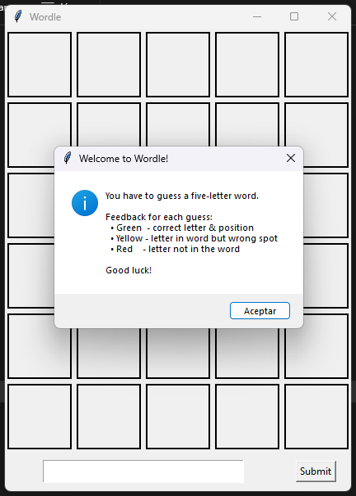
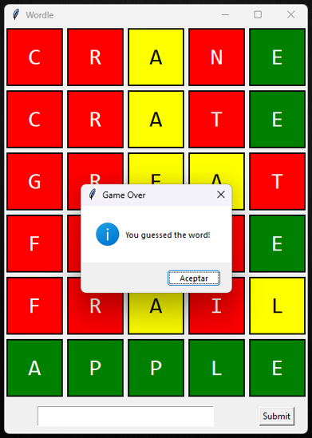

# Wordle Game

A recreation of the popular word game Wordle, built as the final project for the Object-Oriented Programming course.

The game logic is written in C++; the graphical interface is written in Python (Tkinter). The two communicate over an inter-process pipe: the Python GUI launches the C++ engine as a subprocess and exchanges messages with it over `stdin`/`stdout` using a line-based protocol.

The application is packaged into a single Windows executable using PyInstaller.

> Wordle is a trademark of The New York Times Company. This project is an educational recreation and is not affiliated with or endorsed by them.

## Screenshots




## Architecture

Two executables are built from the same underlying C++ engine:

- **`wordle`** - CLI entry point (`main.cpp`). Plays the game entirely in the terminal.
- **`wordle_cpp_bridge`** - Bridge entry point (`src/cpp_interface.cpp`). Reads commands from `stdin` and writes responses to `stdout`. Launched by the Python GUI as a child process.

The Python side (`gui/wordle_gui.py`) uses `subprocess.Popen` to spawn the bridge, then sends guesses and control messages over its `stdin` pipe and reads feedback back from `stdout`. The `CppBridge` class in `gui/cpp_bridge.py` wraps the wire protocol so the GUI code never touches the pipes directly.

### Communication Protocol

All messages are single lines of ASCII text terminated by `\n`. The bridge flushes `stdout` after every response to avoid pipe buffering deadlocks.

| Direction | Message | Meaning |
|-----------|---------|---------|
| Python -> C++ | `<5-letter word>` | Submit a guess |
| Python -> C++ | `RESET` | Start a new round with a new target word |
| Python -> C++ | `EXIT` | Terminate the bridge cleanly |
| C++ -> Python | `<5 digits>` | Feedback per letter: `0` = miss, `1` = correct letter, wrong position, `2` = exact match |
| C++ -> Python | `WIN` | Sent after a `22222` feedback line |
| C++ -> Python | `LOSE:<word>` | Sent after the sixth failed guess; includes the target word |
| C++ -> Python | `READY` | Acknowledgment sent after processing a `RESET` |
| C++ -> Python | `ERROR:init` | Sent if the word list could not be loaded at startup |

## How to Play

Two prebuilt Windows executables are provided (in `dist/`). Both open the same graphical Wordle interface, they differ only in how the target word is chosen.

| Executable | Behavior |
|------------|----------|
| `wordle-random.exe` | Normal gameplay. The C++ engine picks a random 5-letter word from `words.txt` at the start of each round. |
| `wordle-demo.exe` | Demonstration build. The target word is fixed to `apple`, which is useful for testing the interface, verifying feedback colors, and reproducing specific game states.

> The executables are Windows-only. Linux or macOS users would need to run the Python source directly and rebuild the C++ bridge from the sources in src/.

## Project Structure

```
.
├── main.cpp                  # CLI entry point
├── words.txt                 # Word list (one word per line)
├── src/
│   ├── cpp_interface.cpp     # Bridge entry point (I/O protocol)
│   ├── game_manager.cpp      # Turn logic and scoring
│   ├── word_comparison.cpp   # Feedback algorithm (green/yellow/red)
│   └── word_management.cpp   # Word list loading and random selection
├── include/                  # Header files for the C++ engine
├── gui/
│   ├── wordle_gui.py         # Tkinter GUI
│   └── cpp_bridge.py         # Subprocess wrapper (CppBridge class)
├── dist/
|   ├── wordle-demo.exe       # Demonstration build
|   ├── wordle-random.exe     # Normal gameplay
└── docs/                     # Screenshots
```

## Building from Source

The prebuilt `.exe` files are Windows-only. On Linux or macOS, the Makefile can be used to compile from source.

### Prerequisites

- A C++17-capable compiler (`g++` or `clang++`)
- Python 3.8 or newer
- GNU Make

### Build everything

```bash
make
```

This produces:
- `wordle` (or `wordle.exe` on Windows) at the project root, the CLI version
- `gui/wordle_cpp_bridge` (or `.exe`) alongside a copy of `words.txt`, the files the Python GUI needs at runtime

### Play in the terminal (CLI mode)

```bash
./wordle
```

### Play with the GUI (from source)

```bash
make run-gui
```

or manually:

```bash
cd gui
python3 wordle_gui.py
```

### Clean up build artifacts

```bash
make clean
```

## Modules & Contributors

| Module | Author |
|--------|--------|
| `word_management` | Samira |
| `game_manager` | Ana |
| `word_comparison` | Anto |
| `cpp_interface` & `cpp_bridge` | Ayrton |
| `wordle_gui` | Edna |
